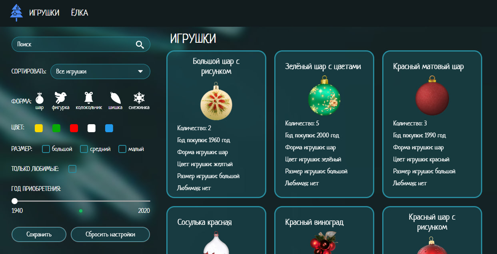

# 🎄 Christmas Tree 

— интерактивное **Angular**-приложение, разработанное для практики с **реактивностью** **(RxJS)**, **Observables**, **BehaviorSubject**. В проекте использованы подходы оптимизации и производительности, такие как **ChangeDetectionStrategy.OnPush** и **Lazy Loading**.

### Функционал
Пользователь может сортировать игрушки по названию и количеству, находить игрушку по названию, фильтровать игрушки по форме, цвету, размеру, а также приложение имеет интерактивную страницу, где можно украсить новогоднюю елку выбранными игрушками, включить музыку и наблюдать анимированный снег.  

---

### Что я узнала
- Как организовывать логику в сервисах вместо компонентов
- Работа с BehaviorSubject, Observables и реактивностью RxJS
- Оптимизировать компоненты через ChangeDetectionStrategy.OnPush
- Как проектировать приложение на Angular
- LocalStorage для сохранения настроек

### Технологии
- Angular 20+  
- TypeScript
- RxJS

## Скриншоты проекта





### Установка и запуск
```bash
# Клонировать репозиторий
git clone https://github.com/ulzirok/angular-christmas-tree.git

# Установить зависимости
npm install

# Запустить Angular-приложение
ng serve


